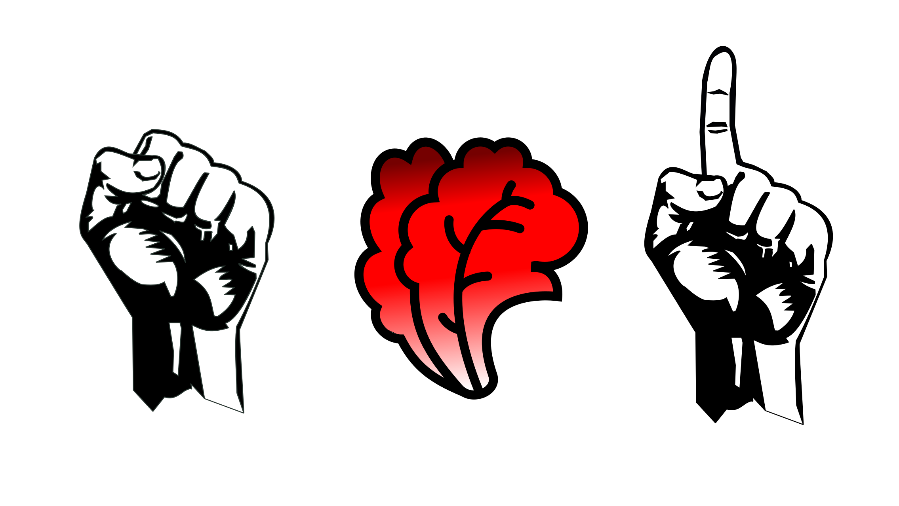

_[English version below]_

Il primo maggio è la festa dei lavoratori, che per me è la giornata nazionale più politica dell'anno e, sotto questo aspetto, la più importante: infatti le politiche lavorative sono un campo in cui anche le fazioni ideologicamente affini si scontrano; probabilmente perché si passa dall'ideologia alle decisioni pratiche, che però sono alla fine la cosa che conta.

Questo articolo è un elenco di problematiche aperte, attuali, che riguardano il mondo del lavoro. Molte se non tutte sono fortemente influenzate dalla situazione Covid: sono infatti previsti forti ricadute di questa epidemia a livello globale [^1]; d'altronde, nel nostro mondo connesso ha senso aspettarsi di avere pandemie[^2]. Spero di dire, se non qualcosa di intelligente (scrivo questo articolo perché penso sia importante, non perché sono esperto), almeno qualcosa di utile; con l'ulteriore speranza che questo momento di crisi sia occasione di rendere più equa la nostra società.

Premetto ancora un ringraziamento al gruppo di amici che ho conosciuto in occasione della manifestazione delle Sardine, con cui ho avuto modo di organizzare un incontro su queste tematiche per festeggiare il primo maggio e che mi hanno dato molti spunti.

## Mio zio l'aveva detto
Ho subito chiesto allo stesso zio di [questo articolo](https://gabrielelabanca.github.io/blog/archive/2018/01/06/cofferati_a_ciascuno_il_suo_mestiere.html) qualche idea per affrontare l'argomento. Mi ha segnalato il problema di mancata rappresentanza che ha la categoria dei lavoratori non dipendenti, ossia i precari e i lavoratori occasionali. Questo problema è emerso anche all'interno del nostro incontro: l'esperienza di un lavoratore libero professionista è fatta di ore lavorate nei giorni di festa e stipendi non sicuri. Un altro elemento, ovvio, è la disparità di diritti tra diverse categorie.

## [Nero a metà](https://it.wikipedia.org/wiki/Nero_a_met%C3%A0)
Il lavoro nero è anche "ibrido": spesso i cosiddetti schemi contrattuali flessibili (part-time, per esempio) sono applicati in modo scorretto, pagando in nero ore aggiuntive; inutile dire che questo va solitamente a svantaggio del lavoratore subordinato[^3]. Anche questa è un'esperienza condivisa da alcuni partecipanti alla riunione.

Il problema del lavoro nero è emerso ancora più forte in questo periodo di emergenza epidemica, per la necessità di giustificare uno spostamento, insieme con l'impossibilità di farlo perché il rapporto di lavoro non è dichiarato[^4]. Non manca del punto di vista di chi gli irregolari sfrutta (noi tutti, [se non fosse chiaro](https://gablab.gitlab.io/gablog/che-bello/)): con l'avvento della stagione dei raccolti verrebbe a mancare manodopera, quindi si è parlato di regolarizzare quei lavoratori senza contratto che servono, ossia gli stagionali[^5]. Se vi sembra un ragionamento un po' freddo, se vi chiedete perché non regolarizzarli tutti, penso sia lecito, ma vi prego di non fermarvi alle risposte semplici.

## Problemi di genere
La pandemia ha visto aumentare vertiginosamente il numero di casi di violenza domestica, immagino per il maggiore contatto tra vittima e molestatore dovuto al lockdown[^6]. È anche divenuto più difficile scappare dal molestatore, non avendo un posto dove andare, e accogliere chi è in fuga nelle strutture, a causa di ragioni di sicurezza. Un altro problema, che ho visto evidenziare dalla Carofalo, è che la chiusura delle scuole significherà probabilmente che a prendersi cura dei figli saranno le madri, le quali saranno quindi svantaggiate nel rientro lavorativo. D'altronde non sembra al momento saggio riaprire le scuole, secondo alcune stime tecniche[^7].

## Datori di lavoro
È facile prendere le parti esclusivamente del datore di lavoro o del subordinato;  evidente che questa tentazione va evitata, se si vuole valutare obiettivamente la situazione. Non va comunque dimenticato che il subordinato ha tendenzialmente meno tutele[^3] e che il datore di lavoro ha la responsabilità di valutare i rischi sul luogo di lavoro, mentre è difficile per il subordinato ottenere il diritto di astensione individuale dalla prestazione lavorativa[^8]. Sono molte in Italia le attività che non hanno chiuso durante il lockdown: se sicuramente in molti casi questa decisione sarà stata dovuta alla necessità di non subire troppi danni economici, altrettanto sicuramente questi danni sono stati scaricati in forma sanitaria sui dipendenti, invece che ammortizzati dallo Stato (ma chi ammortizza i danni dello Stato? La coperta è forse troppo corta?)[9]. Altra cosa emersa nell'incontro è la facilità con cui un'organizzazione malavitosa può sostituirsi allo Stato quando esso non sia in grado di soddisfare ai bisogni dei cittadini.

___________

Qua si chiude il riassunto del mio piccolo sforzo, che informativo è stato per me, ma spero anche per voi. Non sono tematiche che conosco bene, quindi qualunque commento è gradito. Si può seguire il <b>gablog</b> su <a href="https://www.facebook.com/gablablog/">Facebook</a> o tramite il meno invadente canale <a href="https://t.me/gab_log">Telegram</a>.

_[English version]_

May the 1st is the Workers' Day, which for me is the most political national day of the year and, under this respect, the most important: indeed, workers' policies are a field in which even the most ideologically similar factions argue; probably because there is a passage from ideology to practical decision, that however are in the end the important thing.

This article is a list of open, contemporary problems, that concern jobs. Many if not all are strongly influenced by the Covid situation: strong consequences are indeed expected from this pandemic at a global level [^1]; after all, in our connected world it makes sense to expect having pandemics[^2]. I hope I will say, if not something smart (I write this article because I think it's important, not because I am expert), at least something useful; with the further hope that this critical moment will lead to a more equal society.

Before starting, I would like to say thanks to the friends that I met during Sardine demonstration, with whom I had the possibility to organise a meeting about these themes to celebrate on 1st May, and who gave me many prompts.

## My uncle had said that
I immediately asked the same uncle of [this article] (https://gabrielelabanca.github.io/blog/archive/2018/01/06/cofferati_a_ciascuno_il_suo_mestiere.html) some ideas to approach the topic. He pointed out to me the problem of the missing representatives for occasional and precarious workers. This problem emerged during our meeting, too: the experience of a freelance worker is made of working hours in non-working days and uncertain salaries. Another element, obvious, is the diversity of rights between different categories.

## [Nero a metà](https://it.wikipedia.org/wiki/Nero_a_met%C3%A0) (Half-reported employment)
The reporting of employment can be "hybrid": often the so-called flexible contractual schemes (for instance, part-time) are applied in a wrong way, paying without reporting part of the hours; it goes without saying that this is usually detrimental for the subordinate worker[^3]. This too is an experience shared by some participants to our meeting.

The problem of unreported employment emerged even more strong in this moment of epidemic emergency, for the need of justifying one's movements, together with the impossibility of doing so because the working relationship was not declared[^4]. Let us not miss the point of view of the exploiters of irregularity (us all, [in case it is not clear](https://gablab.gitlab.io/gablog/che-bello/)): with the arrival of the harvesting season workers would be missing, so it has been talked about making regular those workers without contract that are useful, that is the seasonal workers[^5]. If you think it is an impassive reasoning, if you are wondering why not make everyone regular, I think it is legitimate, but please do not stop to the easy answer.

## Gender issues
The pandemic lead to a vertiginous increase of domestic violence cases, I suppose because of the increased contacts between the victim and the molester due to the lockdown[^6]. Running away from the molester also became more difficult, if one has no place to go, as well as host the runaway in structures, due to safety reasons. An other problem, that I saw highlighted by Carofalo, is that closing schools will probably mean that mothers will be the ones taking care of children, and they will be then disadvantaged in going back to work. On the other side, reopening schools does not appear wise at the moment, according to technical estimates[^7].

## Employers
It is easy to take the parts exclusively of either the employer or the employee; it is evident that this temptation has to be avoided, if there is the desire of an objective evalulation of the situation. It is hovever better not to forget that the employee has usually less safeguards[^3] and that the employer has the responsibility of evaluating the risks on the workplace, while it is difficult for the employee to obtain the right of individually avoid going to work[^8]. In Italy there are many businesses that didn't close during the lockdown: if this decision in many cases is presumably due to the necessity of avoiding too much economical damage, it is also true that this turns out in a health burden for employees, instead of being amortised by the State (but who will amortise the damage for the State? Is the curtain too short?)[^9]. An other aspect that emerged in the meeting is the ease with wich the organised crime can substitute the State when it is not able to satisfy the needs of citizens.

___________

Here I close the resume of my small effort, that has been informative for me, but I hope for you too. I don't know these themes so well, so any comment is welcome. It is possible to follow the <b>gablog</b> on <a href="https://www.facebook.com/gablablog/">Facebook</a> or with the <a href="https://t.me/gab_log">Telegram</a> channel.

[^1]:https://www.repubblica.it/esteri/2020/04/07/news/coronavirus_l_allarme_oil_effetti_devastanti_sul_lavoro_-253375682/
[^2]: https://www.ted.com/talks/alanna_shaikh_why_covid_19_is_hitting_us_now_and_how_to_prepare_for_the_next_outbreak?utm_campaign=tedspread&utm_medium=referral&utm_source=tedcomshare
[^3]: https://www.diritto.it/lavoro-in-nero-ai-tempi-del-coronavirus-cosa-cambia-e-come-ci-si-tutela/
[^4]: https://www.termometropolitico.it/1514734_coronavirus-e-lavoro-nero.html?cn-reloaded=1
[^5]: https://www.repubblica.it/cronaca/2020/04/21/news/coronavirus_lamorgese_alla_camera_-254595213/
[^6]: https://www.independent.co.uk/news/world/americas/mexico-coronavirus-domestic-violence-women-murder-femicide-lockdown-a9488321.html?utm_medium=Social&utm_source=Facebook#Echobox
[^7]: https://drive.google.com/file/d/1pe1gEp4-UAPxLW_vnqntAa4AT5D_nyR1/view
[^8]: https://www.puntosicuro.it/sicurezza-sul-lavoro-C-1/rubriche-C-98/interviste-inchieste-C-117/l-impatto-della-pandemia-covid-19-sul-mondo-del-lavoro-AR-19968/
[^9]: https://www.ansa.it/sito/notizie/economia/2020/04/14/istat-attivita-aperte-per-il-557_a0a35e3c-e299-4bdc-ac23-e5eca57994c9.html

_[Head image: Salad by Ben Davis from the Noun Project; tomato by Rita Cabecinhas from the Noun Project; Pepper by Luiz Carvalho from the Noun Project]_

