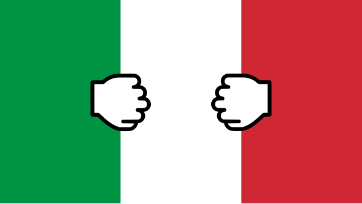

---
layout: post
title: Ricordo e propaganda - Memorial and propaganda
categories: [società]
tags: []
date: 2020-04-25
---

[English version below]

Questo giorno di Liberazione significa il ricordo dell'abbandono di un regime che (ne ho parlato [qui](https://gablab.gitlab.io/gablog/i-poeti-che-strane-creature)) poco di buono faceva al Paese: se si vive contentamente all'interno della società democratica che da queste premesse è nata, non si può che essere grati a questo avvenimento, dedicando qualche momento a meditare sui processi storici e politici e anche sui sacrifici personali in nome di un ideale che tutti hanno contribuito a portarci dove siamo.

C'è un aspetto di questa giornata, quello celebrativo, che vorrei qua discutere, sperando di dire qualcosa di non troppo banale.

Il 25 aprile ha anche le sembianze di un altro giorno di propaganda a favore del consenso verso l'attuale regime, usando il pretesto che se esso nasce dal mito di eroi così ottimi non può che essere ottimo anch'esso. La conseguenza estrema di ciò è l'eliminazione del bisogno di discuterne. Eppure la democrazia è pur sempre una scelta statistica: _in media_ la condivisione del processo decisionale tra più persone porta a migliori risultati di quanto faccia una monarchia, ma ci sono stati certamente monarchi illuminati e democrazie dalle lunghe ombre (U.S.A., parliamo come sempre di voi; ho giusto appena letto di Terzani che parla del Vietnam); mi piace la democrazia, ma perché giustificarla con un mito, invece che con i vantaggi che porta? La forza di un'idea deve stare nella sua capacità di resistere alla discussione.
Quanto all'eroismo, la stessa generazione degli scrittori del realismo partigiano ha evidenziato anche i lati bassi, umani della Resistenza, oltre che le divisioni ideologiche: penso a _Una questione privata_ di Fenoglio, come esempio maggiore (è uno dei miei romanzi preferiti, se non l'avete letto lo consiglio). È scorretto che uno Stato idealizzi un movimento eterogeneo e imperfetto affermando di esserne la naturale continuazione: la nostra società, la nostra libertà sono altrettanto figlie delle bombe e del consumismo americano. L'attentato a Togliatti, le Brigate Rosse, le mafie, i rigurgiti fascisti e le voglie secessionistiche sono poi tutte indicazioni che la pace non è stata raggiunta, non c'è l'unità che si afferma.

D'altro canto, ci sono le ragioni politiche: è chiaro il pericolo di una deriva autoritaria in Italia e in Europa; se si vuole evitarla sembra senz'altro utile iniettare un po' di retorica antifascista. Ricercare l'omogeneità di movimenti politici diversi tra loro attorno a eventi se non altro antichi è d'altronde la norma, con l'effetto doppio di rendere più evidente la mancanza di terreno comune e di non riconoscere la ricchezza della diversità di idee. Resta il dubbio che il modo migliore per mantenere unito un Paese, lontano il fascismo, viva la democrazia, sia proprio il rafforzamento della propria convizione. Sembra insomma che questa celebrazione sia la scusa non solo per ricordare un evento, ma per rifarsi a esso e invocare una _lotta_, invece che il dialogo.
Ma alla fine, cosa c'è di sbagliato? Non è forse proprio la forza della storia la capacità dell'uomo di credere, in questo caso la ricerca di identità nella politica? Continuo a plagiare _Sapiens_ di Harari: la creazione di miti favorisce la coesione sociale stessa che consente al mito di essere diffuso, autosostenendosi. È un po' il tema dei memi, mi sembra: l'informazione, le idee, i pensieri sono entità che vivono con meccanismi darwiniani sul substrato fisico dell'umanità. E la lotta diventa allora necessaria, perché le idee diventano maggioritarie solo quando riescono a sopraffare le altre.

Dunque, la forza della democrazia è il mito della libertà che la sostiene. Non penso che la libertà sia sbagliata (ma non è un taboo parlarne?), dato che ci sguazzo come un pesciolino, anche se (ipocritamente?) non amo gettare nel calderone di un'idea la mia identità; ed è in fondo un altro mito, forse altrettanto potente, forse irraggiungibile, a farmi pensare e scrivere queste cose.

-------

Lettore, se questo articolo ti è piaciuto, segui il <b>gablog</b> su <a href="https://www.facebook.com/gablablog/">Facebook</a> o tramite il meno invadente canale <a href="https://t.me/gab_log">Telegram</a>.

---------

[English version]

This Liberation Day means the memorial of the end of a regime that (I wrote about that [here]](https://gablab.gitlab.io/gablog/i-poeti-che-strane-creature)) made little good to Italy: if one lives happily in the democratic society that stemmed from this premises, one cannot avoid being grateful for this event, paying some time thinking about the historical and political processes and the personal sacrifices, too, in the name of an ideal, which all contributed leading us to the present moment.

There is an aspect in this day, the celebrative one, that I would like to discuss here, hoping not to say something too trivial.

The "25 aprile" has also the aspect of an other propagandistic day, for gaining agreement towards the actual regime, using as a pretext that, if it was born from the myth of so good heroes, it cannot be other that good, too. The extreme consequence of that is that there is no need to discuss it anymore. However, democracy is a statistical choice: _on average_ sharing the decisional process among many people leads to better results than those of a monarchy, but for sure there have been wise monarchs and dark democracies (U.S.A., we are talking about you, as usual; I have just read of Terzani talking about Vietnam); I like democracy, but why justify it with a myth, instead of its advantages? The power of an idea should be its ability to resist to discussion.
Talking about heroes, the very generation of partisan realism writers highlighted also the low, human aspects of the Resistance, and the ideological divisions: I am thinking about _Una questione privata_ by Fenoglio, as an example. It is not right for a State to idealise an heterogeneous and imperfect movement, asserting itself to be its natural continuation: our society, our freedom are as much offspring of the American bombs and consumerism. The aggression to Togliatti, the Red Brigades, the mafias, the fascist revivals and the secessionistic desires are further suggestions that the peace has not been reached, there is not the unity that is said.

On the other side, there are political reasons: the danger of an autoritarian outcome in Italy and in Europe is clear; if one wants to avoid it, it seems useful to inject some antifascist rhetoric. To research homogeneity in political movements that are different is however the norm, with the double effect of highlighting more the absence of a common ground, and not recognising the richness coming from diversity in opinions. It remains the doubt, that the best way to keep the Country united, fascism away and democracy alive is reinforcing oneself's beliefs. It seems that this celebration is an excuse, not just to remember an event, but to actualise it and invoke a _fight_, instead of a dialogue.
But, in the end, what is wrong? Isn't the capability of man to believe the power of history; in this case, the research of identity in politics? I keep plagiarising _Sapiens_, by Harari: the creation of myths favours the social bonds themselves, which allow the myth to be spreaded, self-sustaining. It is the topic of memes, it seems to me: information, ideas, thoughts are entities that live with Darwinian mechanisms on the physical substrate which is humanity. And the fight becomes then necessary, because ideas become of the majority only when the manage to overcome the others.

So, the power of democracy is the myth of freedom, that supports it. I will not say that freedom is wrong (but isn't talking about that a taboo?), since I swim in it like a fish, but I don't like (hypocritically?) throwing my identity in the pot of an idea; and it is in the end another myth, maybe as much powerful, maybe not reachable, that makes me think and write these things.

---------

Reader, if you liked this article, follow the <b>gablog</b> on <a href="https://www.facebook.com/gablablog/">Facebook</a> or on the Telegram channel <a href="https://t.me/gab_log">Telegram</a>.

