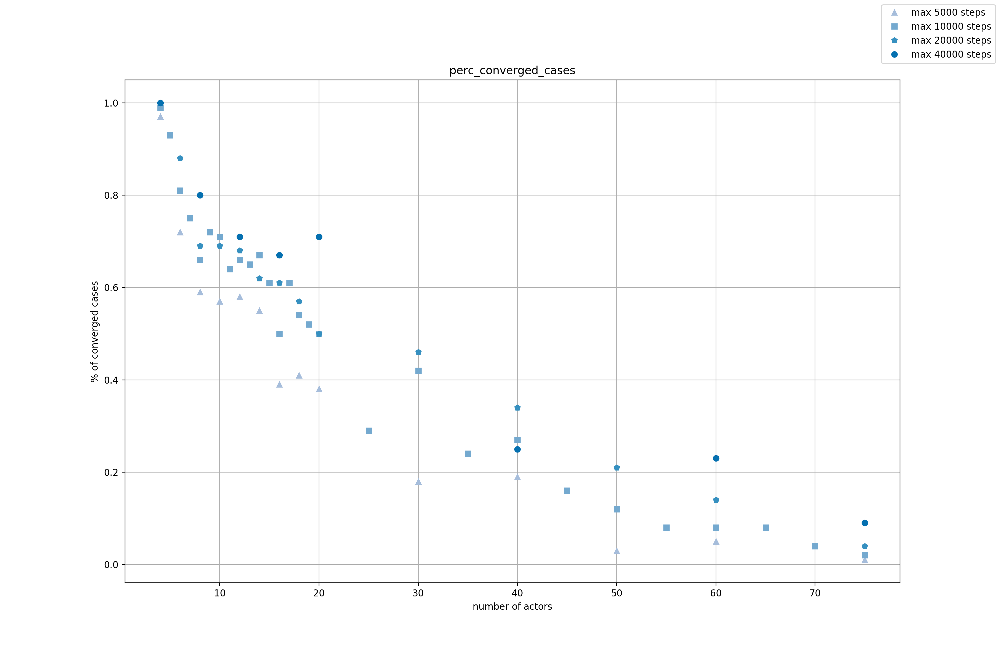

["English - and more technical - version"](https://gablab.gitlab.io/an_actor_world/)

Ovvero, di come l'improvvisazione teatrale e l'informatica si incontrino.

## "Tu pensi troppo"
Così mi son sentito dire tante volte, nei circa sei mesi in cui, tra <a href="http://www.quintatinta.it/">QuintaTinta</a> a Torino e <a href="www.teatribu.it">Teatribù</a> a Milano, frequentavo un corso di improvvisazione. Non starò qui a dilungarmi sull'improvvisazione in sé, anche se penso di poterla consigliare a chiunque, soprattutto perché ci si diverte come matti, ma solo su un esercizio che in queste lezioni tornava spesso. Più facile a farsi che a dirsi: nel gruppo di attori, ognuno sceglie due persone a caso e dal "via" cerca di formare con esse un triangolo equilatero, così (cliccate sul pallino arancione):

      <svg id="mechanism" height="370" width="370">
        <circle id="shadow" cx="266" cy="198" r="20" fill="grey"></circle>
        <circle id="greencircle" cx="320" cy="100"  r="20" fill="orange">
        <animate attributeName="cx" attributeType="XML"
                                    begin="click" dur="2s" from="320" to="266" fill="freeze"/>
        <animate attributeName="cy" attributeType="XML"
                                    begin="click" dur="2s" from="100" to="198" fill="freeze"/>
        </circle>
        <circle id="target1" cx="29" cy="87" r="20" fill="black"></circle>
        <circle id="target2" cx="51" cy="347" r="20" fill="black"></circle>
      </svg>

Chiaramente, la cosa interessante è che queste due persone avranno a propria volta scelto qualcun altro, quindi si muoveranno seguendo i propri bersagli, che ancora avranno altri bersagli e così via, rendendo parecchio difficile arrivare alla condizione in cui tutti sono, finalmente, fermi. Quasi sempre in questa catena di movimenti si ritorna al punto di partenza: _ci si influenza da soli_, in una sequenza causale complessa che si ripiega su se stessa.

## Modellizzare
Un po' di esempi di quello che può succedere: si corre tantissimo, un disastro; movimenti imprevedibili, direbbe Battiato, che accelerano e rallentano improvvisi e in punti diversi del gruppo; a volte, questa la cosa che più mi affascina, ci si ferma... o quasi, poi si riparte a correre; molto di rado (mi è successo solo una volta) ci si ferma davvero, con un certo senso di realizzazione.

Riscrivendo la frase sopra, un po' di fenomenologia, come direi da fisico: non solo la velocità dei singoli attori, ma anche la _velocità media_ del gruppo variano repentinamente, raggiungendo raramente posizioni di _equilibrio_ che sono a seconda dei casi stabili o instabili.

Avrete già capito che lo scopo di questo articolo sarà presentarvi un modello (numerico, cioè simulato con un computer) dell'esercizio che ho descritto. Seguendo il link in Inglese in cima alla pagina, i curiosi trovano più dettagli; qua presenterò i risultati più divulgativamente. Vi dirò solo il principio di massima: una tecnica di simulazione detta "ad agenti". Un **agente** è un'entità in grado di compiere azioni, che dipenderanno dalle condizioni esterne; possiamo immaginarlo come un piccolo robot, solo che è nel computer e non nel mondo fisico. Avere tanti agenti consente di descrivere gruppi di entità, come per esempio formicai, mercati, [colonie di plankton](https://gabrielelabanca.github.io/blog/archive/2019/01/11/tesiplankton.html) e, nel nostro caso, un gruppo di attori.

Nota importante: gli agenti sono per forza di cose una semplificazione delle entità reali, altrimenti programmare la simulazione diverrebbe troppo complicato. Questo, che può sembrare un limite, risulta forse una risorsa, in quanto esige che si pensi a quali caratteristiche sono le più importanti, fornendo in ultima analisi una migliore comprensione dei meccanismi del fenomeno. Nel nostro caso, gli attori sono punti che vedono ciascuno solo altri due punti, chiusi in una stanza quadrata: tanto basta infatti a descrivere il nostro esercizio; questo ci suggerisce che queste caratteristiche siano quelle davvero importanti.

## Facce vede'
Detto, fatto: qua la gif di una simulazione in cui l'equilibrio viene raggiunto (urla di gioia, lancio di coriandoli in sottofondo).

"Ma allora non è così difficile riuscirci!", già vi sento protestare. Mi sono chiesto anche io quanto difficile fosse, ma dobbiamo considerare che questo dipende intuitivamente dal numero di attori in gioco: tre attori impiegheranno pochissimo a raggiungere l'equilibrio (pensateci: la catena si chiude subito), mentre un numero maggiore avrà progressivamente più difficoltà. Lo si vede da questo grafico (solo uno, lasciatemelo fare)[^1]:

Si vede come muovendosi verso destra, cioè verso numeri maggiori di attori, la percentuale di "convergenza all'equilibrio", cioè di probabilità di fermarsi, diminuisca. Ultima cosa da dire, il grafico che si vede sullo sfondo della gif è una misura dell'"energia cinetica", in soldoni della velocità media del gruppo: si vede come, col passare del tempo, essa diminuisca fino a raggiungere lo zero, cioè la velocità nulla, cioè l'equilibrio.

## Contento?
Quasi del tutto: mi sarebbe piaciuto simulare la situazione in cui si arriva vicini a fermarsi, tutti ci sperano e poi di nuovo a correre come dei matti. Ci sono "quasi" riuscito perché, guardando l'animazione qua sotto, è vero che l'energia cinetica ci direbbe che è successo proprio questo (va giù, quasi a zero, poi torna velocemente su), ma se aspettiamo il momento corrispondente nell'animazione osserviamo che ciò corrisponde a un "grumo", più che a uno stallo. Per quanto questa sia una situazione non così irrealistica, dato che capita, non è esattamente quello che stavo cercando.

Però ciò non vuol dire che io non lo sia! Credo che questo esempio, oltre che essere divertente per me e, spero, per chi sa programmare, mi è servito per spiegare rapidamente qualche concetto riguardante la simulazione al computer, che come si sarà capito mi piace parecchio (ho lavorato a questo progetto principalmente nell'ultima settimana di vacanza precedente l'inizio del dottorato).

Vi ringrazio per essere arrivati qui, se volete restare aggiornati sui nuovi articoli seguite il link ai contatti qua in alto e se avete commenti li accolgo con molto piacere. Alla prossima!

[^1]: Per dire tutto: allo scopo di non far durare in eterno le simulazioni, dopo un po' se non raggiungevano l'equilibrio sono state fermate. Questo "tempo massimo" è arbitrario, quindi per essere sicuro che tale scelta non influenzasse i risultati ho deciso di rifare il grafico per diverse possibilità, verificando che il comportamento è praticamente identico.
