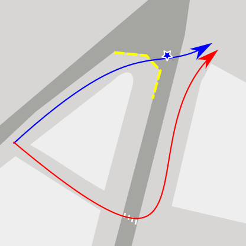
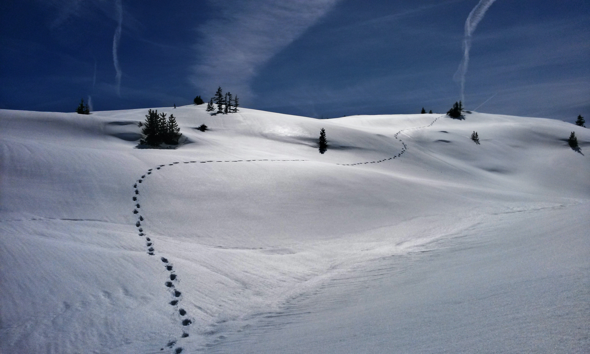
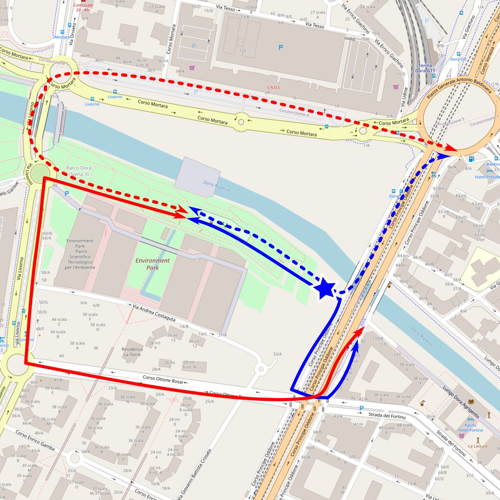

(versione Italiana <a href="#sotto">sotto</a>)

It was at the Utopian Hours festival of 2018 (which I must sadly say deluded me) that I saw live [Mikael Colville-Andersen](http://www.copenhagenize.com/), an urban designer who has played a strong mediatic role in highlighting the importance of road design in order to improve the ciclability in cities. We can see his "pop" approach in the video below and [here](https://youtu.be/0ohY-_dvhn4).

<iframe width="560" height="315" src="https://www.youtube-nocookie.com/embed/d1UbEQ9uIJw" frameborder="0" allow="accelerometer; autoplay; encrypted-media; gyroscope; picture-in-picture" allowfullscreen></iframe>

His talk was pointing out how some principles can effectively encourage people to use bike. What really interested me is the concept of *desire lines*. People often take "alternative" paths, for example crossing a street not exactly when the pedestrian crossings are, or walking through a green area instead of taking the marked walks. Usually these paths are chosen in a similar way by different people, and the average choice is called a "desire line". Here I mark with blue the desire line, with red the regular path: we are at a crossing in Vienna, at the beginning of Rechte Wienzeile, and the yellow line is a fence, though easy to be climbed over. Moreover, if the pedestrian does not know that crossing is forbidden and refuses to follow the desire line, he or she can get to the fence without expecting it, thus having to walk some meters back.  
(If you feel that some unlucky personal episodes may have shaped this analysis, you are not far from truth.)

Following the suggestion of desire lines during the design of a street is of course a smart choice: if the paths do not correspond to them, it will both give discomfort when following the rules and encourage many to break them, decreasing the level of safety and the possibility of optimising the mobility.

To me this concept is a wonderful example of how technologies, tracing the paths followed by people, allow for a better urban planning. However, these technologies are often not necessary, as is exemplified by the traces left in the snow by people walking through.

The story behind this article is a case of such non-technological tracing, and takes place in the beautiful postmodernistic park in my homecity, Parco Dora. Some may argue that this is indeed an ugly park: I tell these critics that the beauty can be find also in imperfection and in the adaptation of pre-existing industrial material; but also that this park has been unlucky, since years have passed since the building works have begun, but still the metal fences are there. 

Let us focus on these fences, which are meant to demarcate the dangerous areas where people should not step. Some of them have been removed by people, some by wind and time; I will not spend time noticing the neglect demostrated by institution not setting them up again, even if it is a somehow serious issue; I wish instead to focus on a particular area enclosed by fences, that I mark with a star in the figure below.

As it can be seen, this area comprises the ideal path to connect the park to the apartment buildings across the road. Sadly, the alternative paths are longer and one of them passes between a semi-abandoned shopping mall and an often congested road (dashed line). 
People solved the problem the hard way: the fence had been broken in a way that allowed people to pass, and the desire line finally appeared through the grass. Due to the lockdown, it is now some months that I don't visit Torino, but the last time I was there this passage had been once more closed: not only a problem was not considered, but the solution that had been found was simply ignored. Even more irritating is the fact that the fences that restricted access to the area (technically still dangerous) from the other side had not been restored. 
This is demonstrating deafness after blindness, but also incoherence.

<iframe src="https://www.google.com/maps/embed?pb=!4v1590402669055!6m8!1m7!1slBMIYUNdQTlo5qWRHnQg9w!2m2!1d45.08775001683109!2d7.675814542419598!3f246.41974333085014!4f-3.173422563597157!5f1.6669251882927152" width="600" height="450" frameborder="0" style="border:0;" allowfullscreen="" aria-hidden="false" tabindex="0"></iframe>

I expect that opening the passage, cleaning from dangerous material the small area covered by the path, and fencing the rest would mean less resources spent for restoring the fences and more safety, plus the feeling of a city built bearing the citizens in mind.

Closing, and more generally, is imposing rigid rules really better than trying to set reasonably flexible boundaries? Wouldn't the latter choice lead to more respect, more trust in institutions and less conflict with them, less waste of resources in solving (read: repressing; more or less effectively, more or less violently) these conflicts?

---------

Reader, if you liked this article, follow the <b>gablog</b> on <a href="https://www.facebook.com/gablablog/">Facebook</a> or on the Telegram channel <a href="https://t.me/gab_log">Telegram</a>.

------------

(Versione italiana)

È stato al festival Utopian Hours del 2018 (che devo tristemente dire mi ha deluso) che ho visto dal vivo [Mikael Colville-Andersen](https://en.wikipedia.org/wiki/Mikael_Colville-Andersen), un progettista urbano che ha avuto un ruolo mediatico prominente nell'evidenziare l'importanza della progettazione stradale per migliorare la ciclabilità urbana. Possiamo vedere il suo approccio "popolare" nel video sopra o [qui](https://youtu.be/0ohY-_dvhn4). 

Il suo discorso metteva in evidenza come alcuni principi possano effettivamente incoraggiare le persone a utilizzare la bicicletta. Ciò che mi ha davvero interessato è il concetto di *desire lines*. Le persone spesso prendono strade "alternative", per esempio attraversanto una strada non esattamente dove sono le strisce pedonali, oppure attraversando un'area verde invece che seguire i sentieri tracciati. Solitamente questi tracciati sono scelti in modo simile da diverse persone e la media delle scelte è chiamata una "desire line". Qua segno con il blu le desire line, con il rosso i tragitti regolari: nell'immagine siamo a un attraversamento a Vienna, all'inizio della Rechte Wienzeile, e la linea gialla è una recinzione, pure se facile da scavalcare. In più, se il pedone non sa che attraversare è vietato e rifiuta di seguire la desire line, può trovarsi alla recinzione senza aspettarsela, dovendo quindi tornare indietro di alcuni metri.  
(Se avete la sensazione che questa analisi derivi da alcuni sfortunati episodi personali, non siete lontani dalla realtà.)

Seguire i suggerimenti dati dalle desire lines durante la progettazione di una strada è sicuramente una scelta intelligente: se i percorsi non corrispondono a esse, ciò darà scomodità quando la regola sia seguita, oltre che incoraggiare di converso a infrangerla; il livello di sicurezza diminuirà, insieme con la possiblità di ottimizzare la mobilità.

Per me questo concetto è un esempio meraviglioso di come le tecnologie, identificando i percorsi seguiti dalle persone, permettano una migliore pianificazione urbana. In ogni caso, queste tecnologie sono spesso non necessarie, come per esempio nel caso delle tracce lasciate nella neve camminando.

La storia dietro questo articolo è un caso di tracciamento non tecnologico e ha luogo nel bel parco postmodernistico della mia città natale, Parco Dora. Qualcuno potrebbe dire che questo è in effetti un brutto parco: a questi critici rispondo che la bellezza può essere trovata anche nell'imperfezione e nell'adattamento di materiale industriale preesistente; ma anche che questo parco è stato sfortunato, dato che sono passati anni da quando i lavori di costruzione sono iniziati, ma le recinzioni metalliche sono ancora là.

Portiamo l'attenzione su queste recinzioni, che sono intese per separare le aree pericolose dove le persone non dovrebbero camminare. Alcune di esse sono state rimosse dalle persone, altre dal vento e dal tempo; non spenderò tempo per notare la noncuranza mostrata dalle istituzioni non restaurandole, anche se si tratta di un argomento abbastanza serio; voglio invece concentrarmi su una particolare area racchiusa dai recinti, che marco con una stella nella figura.

Come si può vedere, quest'area comprende il percorso ideale per connettere il parco ai condomini oltre la strada. Tristemente, i percorsi alternativi sono più lunghi e uno di essi passa tra un centro commerciale semiabbandonato e una strada trafficata (linea tratteggiata).  
I cittadini hanno risolto il problema nel modo più diretto: il recinto era stato rotto in modo da permettere alle persone di passare e la desire line è finalmente apparsa attraverso l'erba. A causa del lockdown è qualche mese che non visito Torino, ma l'ultima volta che sono stato lì questo passaggio era stato nuovamente chiuso: non solo un problema non è stato considerato, ma la soluzione trovata è stata semplicemente ignorata. Ancora più irritante il fatto che le recinzioni che impedivano l'accesso all'area (tecnicamente ancora pericolosa) dall'altro lato non erano state restaurate. Ciò dimostra sordità dopo cecità, ma anche incoerenza.

Mi aspetto che l'apertura del passaggio, dopo aver ripulito dal materiale pericoloso la piccola area coperta dal percorso, e la recinzione del resto significherebbero meno risorse spese per ricostruire le recinzioni e più sicurezza, oltre che la sensazione di una città costruita con il cittadino in mente.

In chiusura, e più in generale, imporre regole rigide è davvero meglio che provare a stabilire limiti ragionevolmente flessibili? Quest'ultima possibilità non porterebbe a più rispetto, più fiducia nelle istituzioni e meno conflitti con esse, meno spreco di risorse nella risoluzione (leggi: repressione; più o meno efficace, più o meno violenta) di questi?

----
Lettore, se questo articolo ti è piaciuto, segui il <b>gablog</b> su <a href="https://www.facebook.com/gablablog/">Facebook</a> o sul più comodo canale <a href="https://t.me/gab_log">Telegram</a>.

