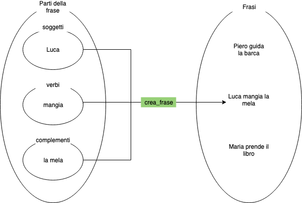
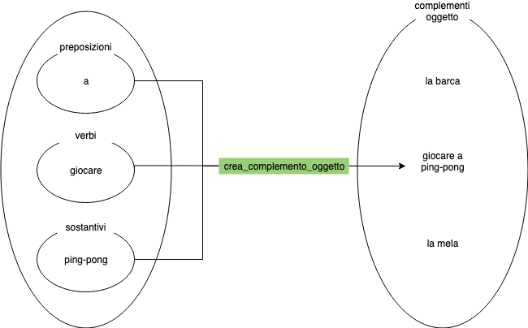

Cosa succede se ponete a gente filosofica e/o matematica il problema della lingua? Lo leggete [qui](https://jcom.sissa.it/archive/01/01/A010103/jcom0101(2002)A03_it.pdf), scoprendo che a molti ha disturbato dover passare da una lingua all'altra per comunicare concetti in sostanza astraibili a formule; da qui il tentativo di creare una lingua artificiale, come l'Esperanto o il _Latino sine flexione_, però per ora fallito [^1]. La causa principale probabilmente è che è difficile "credere" in una lingua quando pochi la parlano [^2]; ma c'è anche un motivo moralmente matematico, ossia l'arbitrarietà: essendo il linguaggio lontano della notazione matematica (altrimenti, appunto, sarebbe una notazione matematica), bisogna introdurre parole la cui forma va imposta, nel migliore dei casi partendo da una o più radici, le quali però vanno scelte e quindi non si risolve all'origine il problema della molteplicità.

Forse dovremmo accettare di vivere in una rottura di simmetria (scusate l'occhiolino alla Fisica), accontentandoci dell'assoluto ricavabile dalla teoria (o realizzabile in condizioni lontane dalla vita reale). Scrive Gabriele Romagnoli in _Solo bagaglio a mano_: <blockquote>due o più vite non ci stanno, c'è spazio per una soltanto, quella che hai.</blockquote>

## Veniamo a noi
Ma questo articolo voleva davvero essere meno serio, mi sentivo solo in dovere di fare una "literature review". L'idea era di tentare una interpretazione __funzionale__ della grammatica. Questo avrà come requisito/effetto collaterale far capire a tutti i lettori che ancora non lo sappiano cosa sono funzioni e classi di equivalenza. Non chiudete la pagina! È la vostra rivincita contro l'intollerabile prima introduzione al concetto di funzione che si trova sui libri del liceo, che suona circa:
> una relazione tra due insiemi che associa a uno o più elementi di uno o più insiemi uno e un solo elemento di un secondo insieme.

Io non avevo capito molto, ma per il libro era evidentemente abbastanza; però vi prometto che entro la fine dell'articolo avrete capito.

Parto da un esempio di quello che voglio ottenere (sarei in realtà partito così anche sul libro):

> "Luca mangia la mela" &hArr; `crea_frase(soggetto="Luca",verbo="mangia",complementi=["la mela"])`

Non sembra complicato, direi: partire dal linguaggio per estrarne gli elementi costitutivi e le relazioni tra essi è alla fine quanto si studia facendo l'analisi logico-grammaticale a scuola. Ed ecco la nostra prima funzione: `crea_frase`, che permette di passare, tramite delle regole, da una serie di elementi (nel nostro caso: soggetto, verbo, complementi) a un altro elemento; questi elementi appartengono a insiemi diversi, in quanto i primi sono parti della frase negli insiemi dei "soggetti", dei "verbi" e dei "complementi" e il secondo è una vera e propria "frase".

L'utilità è evidente, dato che classificare permette di generalizzare più concetti in uno solo, rendendo anche più facile assimilarne di nuovi, incasellandoli in una struttura già pronta. Facciamo un altro esempio: 
> Luca ama Lara &hArr; `crea_frase(soggetto="Luca",verbo="ama",complementi=["Lara"])`

e trasformiamolo in 
> Luca ama giocare a ping-pong &hArr; `crea_frase(soggetto="Luca",verbo="ama",complementi=["giocare a ping-pong"])` 

Qua si apprezza quanto sia potente pensare in questo modo: anche un elemento di analisi del periodo come una subordinata oggettiva può essere considerata un complemento, unicamente per la sua _funzione_ di oggetto. Risuona qualcosa? Possiamo identificare una funzione che crei i complementi, ossia che prenda degli elementi da alcuni insiemi e associ un elemento nell'insieme dei complementi.

Direi che a questo punto siamo abbastanza riscaldati e possiamo passare a un altro livello di astrazione: il disegno qua sopra contiene infatti una quantità di informazione superiore al necessario, dato che avrei potuto scegliere rettangoli al posto di ellissi, per esempio, senza cambiarne il significato. Possiamo quindi sintetizzarlo come segue:

> {preposizioni, verbi, sostantivi, ...} &rArr; [crea\_complemento\_oggetto] &rArr; complementi oggetto

In linguaggio matematico[^3],
> crea\_complemento\_oggetto: {preposizioni, verbi, sostantivi} &#8614; complementi oggetto

## Un gradino più in basso
Fin qua abbiamo gettato le basi e a livello concettuale non andremo molto più in là; però sarebbe bello generalizzare ulteriormente altre parti del discorso, per esempio i verbi: "io amo", "amare", "che egli amasse" al momento sono tre cose scorrelate, che però sappiamo essere tutte declinazioni del medesimo verbo. Per non farla troppo lunga, procedo a esempi; un predicato (che come sapete è verbale, "arrossisco", o nominale, "sono rosso") potrebbe essere espresso così (invece di `crea_###`, ora scriverò solo `###`, dato che penso abbiate capito il senso):
> mangia  &rArr; predicato(mangiare,presente)    
> va      &rArr; predicato(andare,  presente)    
> è rosso &rArr; predicato(nominale(essere,rosso),presente)    
> diventa rosso &rArr; predicato(nominale(diventare,rosso),presente)    

Per i complementi predicativi, qualcosa del genere:
> (lo) mangia vivo &rArr; verbale(predicativo(mangiare,vivo),presente)

Faccio notare che non scelgo il modo (indicativo, congiuntivo, etc.), perché in questo modo la stessa struttura è utilizzabile sia per "Vedo che Luca mangia la mela" sia per "Voglio che Luca mangi la mela", come ha senso che sia poiché è la frase esterna per la sua relazione con la subordinata a determinare la sfumatura di osservazione o di desiderio.

Per un articolo che vuole essere soprattutto un _divertissement_, non credo di dover andare più oltre; se poi a qualcuno interessa, volentieri se ne discute. Rimando quindi all'ultimo paragrafo per un ulteriore esempio, che dovrebbero auto-spiegarsi e dimostrare che si può effettivamente andare oltre semplici frasette; ma prima...

## Classi di equivalennza 
Prima di concludere, necessito visceralmente di fare un'osservazione: le frasi "che Luca mangi una mela", "Luca mangia una mela", "Luca mangia una mela?" e "Uffa, Luca mangia una mela" sono a questo punto tutte espresse dalla medesima costruzione: `frase(verbo=predicato("mangiare",presente,indicativo),soggetto="Luca",complementi=[oggetto("la mela"))`.

Per essere precisi, questa è quindi una funzione che va a più elementi (le nostre tre frasi), ma come sappiamo dalla definizione all'inizio dell'articolo una funzione può andare in un solo elemento. Come risolvere questo problema? Semplice: la funzione manda in __classi di equivalenza__, ossia gruppi di frasi accomunati dal medesimo significato[^4]. Chiaramente nulla vieta di essere più specifici e indicare se una frase sia esclamativa, interrogativa o semplicemente affermativa; al contrario, di essere più generici e accomunare alle frasi qua sopra, nella stessa classe di equivalenza, anche frasi come "Luca divora il pomo".

## Gran finale
Dai, chiudiamo in tamarria: ora vi faccio vedere come potrebbero uscire le prime due terzine della _Comedìa_ (_Divina Commedia_) di Dante se tradotte in "grammatica funzionale". Faccio solo un appunto: espressioni come `passato(presente)` vogliono dire _passato rispetto al presente_ ("Ti racconto ciò che è successo"); oppure, `passato(passato)`, _passato rispetto al passato_ ("Mi raccontava ciò che era successo"); se non ci sono le parentesi si intende sempre _rispetto al presente_. Anzi, ne faccio un secondo: visto che il mio[^5] modello è figo, come accennato sopra basta mettere una frase come complemento per creare una subordinata!

> Nel mezzo del cammin di nostra vita,   
> mi ritrovai per una selva oscura,       
> ché la diritta via era smarrita.       
> Ahi quanto a dir qual era è cosa dura  
> esta selva selvaggia e aspra e forte    
> che nel pensier rinova la paura.        

diventa (per non appesantire, non scrivo le parole tra virgolette)

> frase(    
>  &nbsp; &nbsp; verbo=predicato(ritrovare,passato(presente)),    
>  &nbsp; &nbsp; soggetto=pronome(1,singolare),    
>  &nbsp; &nbsp; complementi=[ luogo(stato, attributo(oscuro,selva)),  
>  &nbsp; &nbsp; &nbsp; &nbsp; tempo(contemporaneità,    
>  &nbsp; &nbsp; &nbsp; &nbsp; &nbsp; &nbsp; specificazione(specificazione(specificazione(pronome(1,plurale),vita),cammino),mezzo)    
>  &nbsp; &nbsp; &nbsp; &nbsp; ),   
>  &nbsp; &nbsp; &nbsp; &nbsp; causa(frase(verbo=predicato(nominale(essere,smarrito)),soggetto=(attributo(diritto,via))))   
> )
> 
> frase(    
>  &nbsp; &nbsp; verbo=predicato(verbo=predicato(nominale(essere,attributo(duro,cosa)),presente),     
>  &nbsp; &nbsp; soggetto=frase(    
>  &nbsp; &nbsp; &nbsp; &nbsp; verbo=predicato(dire,presente),    
>  &nbsp; &nbsp; &nbsp; &nbsp; complementi=[oggetto(frase(  
>  &nbsp; &nbsp; &nbsp; &nbsp; &nbsp; &nbsp; verbo=predicato(essere,passato(presente)),   
>  &nbsp; &nbsp; &nbsp; &nbsp; &nbsp; &nbsp; soggetto=attributo([esto,selvaggio,aspro,forte],selva),   
>  &nbsp; &nbsp; &nbsp; &nbsp; &nbsp; &nbsp; tipo=interrogativa(modo)   
>  &nbsp; &nbsp; &nbsp; &nbsp; ))]   
>  &nbsp; &nbsp; ),   
>  &nbsp; &nbsp; complementi=[consecutiva(frase(  
>  &nbsp; &nbsp; &nbsp; &nbsp; verbo=predicato(rinnovarsi,presente),   
>  &nbsp; &nbsp; &nbsp; &nbsp; soggetto=paura,  
>  &nbsp; &nbsp; &nbsp; &nbsp; complementi=[luogo(stato, pensiero)]  
>  &nbsp; &nbsp; ))],  
>  &nbsp; &nbsp; tipo=esclamativa(quantità))     
> )

Il tipo della frase, che se non espresso è inteso come semplice affermazione, va inteso come segue: una frase come "quanto sei bello!" avrà un tipo esclamativo di quantità, che diventerà di modo se avrò usato "come" in funzione di avverbio esclamativo; idem per "quanto... ?" e "come... ?", rispettivamente `interrogativa(quantità)` e `interrogativa(modo)`.

Spero di essere riuscito a convincervi che questa roba funziona. Faccio la traduzione al contrario come controprova: partendo dalle mie funzioni, si ottiene una sorta di parafrasi (è infatti tramite parafrasi e analisi logica che le ho scritte): 
> Io mi ritrovai in una selva oscura nel mezzo del cammino della nostra (=di noi) vita poiché la via diritta era smarrita. Quanto è dura cosa il dire come fosse esta selva selvaggia, aspra e forte, tanto che la paura si rinnova nel pensiero!

Frega poco se mi "mettete mi piace" all'articolo; ma se questo vi è piaciuto fatemelo sapere, se vi ha almeno interessato criticatemelo, se vi ha nauseato ditemi perché. Ciò detto, se volete seguire il gablog guardate la sezione "Contatti". 

A tra due settimane, con qualcosa che non ho chiaramente ancora deciso né preparato!

[crediti dell'immagine: thebarrowboy [CC BY 2.0 (https://creativecommons.org/licenses/by/2.0)] ]

[^1]: Gli unici tentativi riusciti riguardano solo l'alfabeto e non l'intera lingua: ricordo il cirillico e il coreano.

[^2]: Ci scappa un parallelo con l'inerzia che riguarda l'adozione di nuovi linguaggi di programmazione e loro "dialetti".

[^3]: Ossia "la funzione crea\_complemento\_oggetto manda elementi dagli insiemi preposizioni, verbi, sostantivi etc. nell'insieme dei complementi oggetto", crea quindi complementi oggetto.

[^4]: Mi rendo conto che questa spiegazione è noiosa per chi le conosce già e poco significativa per chi le vede per la prima volta; però sento di aver già tirato la corda con le funzioni e preferisco scocciare i lettori per una riga che farlo per un intero paragrafo.

[^5]: Non ho cercato molto, potrei aver re-inventato la ruota; nel caso fatemelo presente, per favore. Comunque sia, da questo articolo verrebbe tolta soltanto la parte in cui me la tiro.

