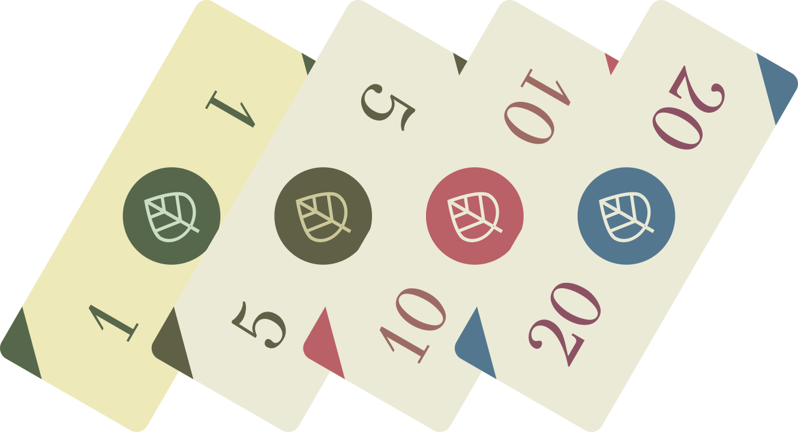

_[Italiano in basso]_

In the old times, one had to find its victim, act stealthily, maybe corrupt officials, safely store the stolen goods. Luckily, the society has evolved, and today we can steal _remotely_, no lockdown will stop us. Wheter we define stealing as taking away resources from someone else, or as getting for free something we should pay,it is embedded in our lifestyle.

I elaborated this thought considering the emblem of our consummeristic society, that is commuting by car. Pollution has a huge impact on our health, if we do not want to count the smaller one on climate change, and this will cost money to society, for example in healthcare. On the other side, the solutions to this are nowadays increasing the quality and coverage of public transport, and improving the biking infrastructure in cities; maybe also going remote, in some situations, could reduce the need of commuting; but these transformations, again, require money, both from society and from companies: talking with my mobility expert friend Shahrom, I sadly understood how little it is profitable to provide public transport services. In any case, the people choosing to use the car are _not_ paying for the damage to society that this involves. 

One could argue that cars are already quite expensive, but here is my point: they are not expensive enough. And this is general: we pay for goods and services a **production cost**, without considering the whole  of our choices. We eat lots of food, lots of meat, heat up our flats during winter and cool them during summer, use cars and airplanes for leisure, buy stuff that we do not need. There is nothing bad in wanting some treat now and then, but where is the limit? Paying the real cost for what we consume would for sure give us some measure.

Who are we stealing from? It depends, of course, but I think that a good, short answer is "from the poorer and the younger". Robin Hood disapproves. From the poorer countries, when we are importing from countries where work costs less, or when we are financing deforestation abroad; from the poorer citizens, when we pollute with our cars and they cannot afford one, but still get the pollution; from future generations, when we favour climate change with consummeristic choices. That is why I called it "remote": we do not even know who we are stealing from!

What about corruption? We do not need it anymore; or, better, we have integrated it in our society, with the laws themselves allowing this kind of theft. It has nevertheless always been the case that society protects the interests of its members, _against_ the interests of the others; and underestimating the interest of the least privileged members. The difference, here, is that we could soon realize that we ended up stealing to ourselves, as the word "future" in "future generations" becomes every day more similar to "tomorrow".

______

Ai vecchi tempi, si doveva cercare una vittima, agire di nascosto, magari corrompere qualche ufficiale, conservare in un luogo sicuro il bottino. Fortunatamente, la società si è evoluta e oggi possiamo rubare _da remoto_, nessun isolamento ci fermera'. Sia che per rubare intendiamo sottrarre risorse a qualcun altro, oppure ottenere gratuitamente qualcosa che dovremmo pagare, è parte integrante del nostro stile di vita.

Ho elaborato questo pensiero considerando l'emblema della nostra società consumistica, che è il pendolarismo in auto. L'inquinamento ha un impatto enorme sulla nostra salute, se non vogliamo contare quello più piccolo sul cambiamento climatico, e questo costerà denaro alla società, per esempio per l'assistenza sanitaria. D'altra parte, le soluzioni a questo problema sono oggi l'aumento della qualità e della copertura del trasporto pubblico, e il miglioramento delle infrastrutture ciclabili nelle città; forse anche passare al remoto, in alcune situazioni, potrebbe ridurre la necessità di fare pendolarismo; ma queste trasformazioni, ancora una volta, richiedono denaro, sia dalla società che dalle aziende: parlando con il mio amico esperto di mobilità Shahrom, ho purtroppo capito quanto sia poco redditizio fornire servizi di trasporto pubblico. In ogni caso, le persone che scelgono di usare l'auto non pagano i danni che ciò comporta per la società. 

Si potrebbe sostenere che le auto sono già alquanto costose, ma ecco il mio punto: non sono abbastanza costose. E questo è generale: noi paghiamo per i beni e i servizi un **costo di produzione**, senza considerare l'intero  delle nostre scelte. Mangiamo molto cibo, molta carne, riscaldiamo i nostri appartamenti d'inverno e li rinfreschiamo d'estate, usiamo auto e aerei per il tempo libero, compriamo cose che non ci servono. Non c'è niente di male nel volere un po' di piacere ogni tanto, ma dov'è il limite? Pagare il costo reale per quello che consumiamo ci darebbe sicuramente qualche misura.

A chi rubiamo? Dipende, naturalmente, ma credo che una buona, breve risposta sia "ai più poveri e ai più giovani". Robin Hood disapprova.Dai paesi più poveri, quando importiamo da dove il lavoro costa meno, o quando finanziamo la deforestazione all'estero; dai cittadini più poveri, quando inquiniamo con le nostre auto e loro non possono permetterselo, ma ricevono comunque l'inquinamento; dalle generazioni future, quando favoriamo il cambiamento climatico con scelte consumistiche.  Per questo l'ho chiamato "remoto": non sappiamo nemmeno a chi stiamo rubando!

E la corruzione? Non ne abbiamo più bisogno; o, meglio, l'abbiamo integrata nella nostra società, con leggi che consentono esse stess questo tipo di furto. Tuttavia, è sempre successo che una società proteggesse gli interessi dei propri membri, _contro_ l'interesse degli altri; e sottostimando l'interesse dei membri meno privilegiati. La differenza, qui, sta nel fatto che potremmo presto realizzare che abbiamo finito per rubare a noi stessi, siccome la parola "futuro" nella frase "generazioni future" diventa ogni giorno più simile a "domani".

