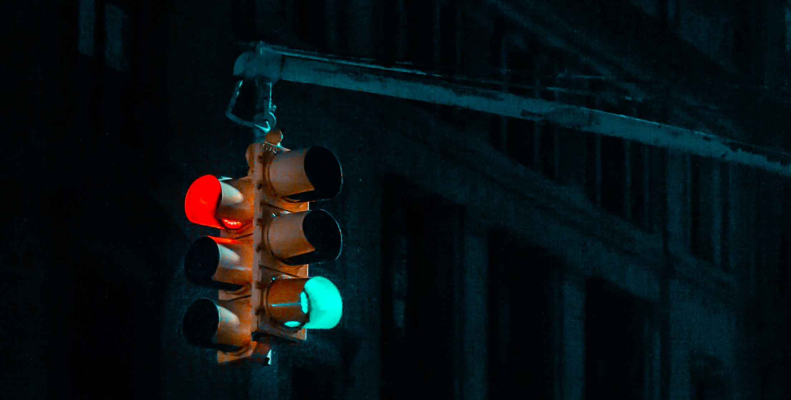

_[Italiano sotto]_

Have you ever wanted to __see__ the traffic?

I am not talking of some bizarre car-watching, but rather of the traffic as being a number ("how many cars pass by in a given time interval"), which varies depending on where and when one measures it. Unless you can watch a road from above (if you own such a flat let's be friends), it is not easy to have a perception of this; but here is where numbers can come useful: for example, I could tell you that on this road 10 cars have passed in an hour, and you would immediately get that this is a much quieter road than one in which 100 cars pass every hour.

Nice and clear, but some more details need to be worked out, namely the time and date of the measures above: the same road can be very busy in the rush hours and much quieter during the night; and a Saturday night is very different from the others. 

We are very lucky: the guys at ETH (Zürich) have made publicly available a [database](https://www.ivt.ethz.ch/forschung/mfd.html) containing the measurements made by a number of detectors in various cities of the World, among several weeks, providing exactly the traffic flow data we need. And, since Torino is my home city (hi Torino 💚), why not working on this data to help my fellow citizens to have a clear view of _where_ the traffic mostly flows? See the full code [here](https://observablehq.com/@gabrielelabanca/torino-traffic).

Some necessary technical details: the flow is measured as the number of cars passing every hour on a given road, divided by the number of lanes, so the value actually measures how _occupied_ a road is (and not how much transportations it holds up).

My analysis goes as follows: in the interactive map, you can choose the time of the day, and between the business days and the weekend; for each detector, all data matching your request are put together and averaged. This allows to compare the situations we saw above: Saturday night or Monday morning? Play with it!

<iframe id='plot1' width="100%" height="593" frameborder="0"
  src="https://observablehq.com/embed/@gabrielelabanca/torino-traffic?cell=viewof+in_values&cell=map"></iframe>

If you are a precise person, you will want something more: the map above is great to grasp the qualitative picture, but what if our question is wheter Saturday night is more busy than Monday morning? It is not easy to get this information from a qualitative map, and we would rather use a plot. Oh, what a coincidence: I have one here!

<iframe id='plot2' width="100%" height="426" frameborder="0"
  src="https://observablehq.com/embed/@gabrielelabanca/torino-traffic?cell=viewof+stackedBar"></iframe>

Now it is easy to answer: on Monday at 8a.m.the peak is at almost 800 cars per lane per hour, while on Saturday at midnight the number is around 300. Other random observations: 
- the morning peak is higher and narrower, while in the afternoon people have a less defined rush hour, probably because extra-work tasks pile up strongly depending on each person's lifestyle;
- during the weekend, people seat at the lunch table between midday and 1p.m.; given the peak just before, people are probably moving to reach the lunch place;
- Saturday is the only day in which there is a third peak of flow, during the night.

This is it for now, I will maybe come back on this. I hope you like it and do not hesitate to send any comment or suggestion! You can reach to me following the About page. Have a nice day!

______

Hai mai voluto __vedere__ il traffico?

Non sto parlando di qualche strambo avvistamento di automobili, ma del traffico in quanto numero ("quante automobili passano in un intervallo di tempo"), che varia a seconda di dove e quando uno lo misuri. A meno che tu non possa osservare una strada dall'alto (se hai un appartamento del genere, diventiamo amici), non è facile averne una percezione; ma qui è dove i numeri tornano utili: per esempio, potrei dirti che su questa strada sono passate 10 automobili in un'ora, e sapresti subito che questa è una strada molto più tranquilla di una dove ne passino 100.

Bello e chiaro, ma bisogna lavorare su qualche dettaglio, ossia la data e l'ora delle misure: la medesima strada può essere molto trafficata nelle ore di punta e molto più tranquilla durante la notte; e una sera di sabato è molto differente dalle altre.

Siamo molto fortunati: i ragazzi all'ETH (Zürich) hanno reso pubblico un 
[database](https://www.ivt.ethz.ch/forschung/mfd.html) contenente le misure fatte da numerosi rilevatori in varie città del mondo, durante diverse settimane,
fornendo esattamente i dati sul flusso di traffico di cui abbiamo bisogno. E, siccome Torino è la mia città natale (ciao Torino 💚), perché non lavorare su questi dati per aiutare i miei concittadini ad avere una visione chiara di _dove_ il traffico scorra principalmente? Il codice completo si trova [qui](https://observablehq.com/@gabrielelabanca/torino-traffic).

Alcuni necessari dettagli tecnici: il flusso è misurato come numero di automobili per ora per una strada, diviso per il numero di corsie, in modo che questo valore rappresenta quanto una strada è _occupata_ (e non quanto carico di trasporto sostiene).

La mia analisi procede come segue: nella mappa interattiva, si può scegliere il momento della giornata, e tra i giorni festivi e feriali; per ogni rilevatore, tutti i dati che rientrano nella scelta vengono messi insieme e mediati. Ciò permette di confrontare le situazioni che abbiamo visto sopra. Sabato sera o lunedì mattina? Prova varie combinazioni!

Se sei una persona precisa, vorrai qualcosa di più: la mappa è ottima per avere una visione qualitativa, ma poniamo che la nostra domanda fosse se il sabato sera è più o meno trafficato del lunedì mattina; non è facile ricavare questa informazione da una mappa qualitativa e bisognerebbe usare un grafico. Oh, che coincidenza: ne ho uno [qui](#plot2)!

Ora è semplice rispondere: il lunedì alle 8 di mattina il picco è a quasi 800 auto per corsia per ora, mentre il sabato a mezzanote questo numero è intorno a 300. Altre osservazioni in ordine sparso:
- il picco del mattino è più alto e stretto, mentre al pomeriggio le persone hanno un'ora di punta meno definita, probabilmente perché le commissioni extralavorative si accumulano in modo fortemente dipendente dallo stile di vita di ognuno;
- durante il finesettimana, la gente si siede a pranzo tra mezzogiorno e l'una; visto il picco appena precedente, ci si sposta probabilmente per raggiungere il posto di lavoro;
- sabato è l'unico giorno in cui si ha un terzo picco, durante la notte.

Questo è quanto, forse ci tornerò su. Spero che l'articolo ti sia piaciuto e non esitare a mandare commenti o suggerimenti! Puoi raggiungermi dalla pagina About. Passa una buona giornata!

______

_(Photo by David Watkis on Unsplash.)_
