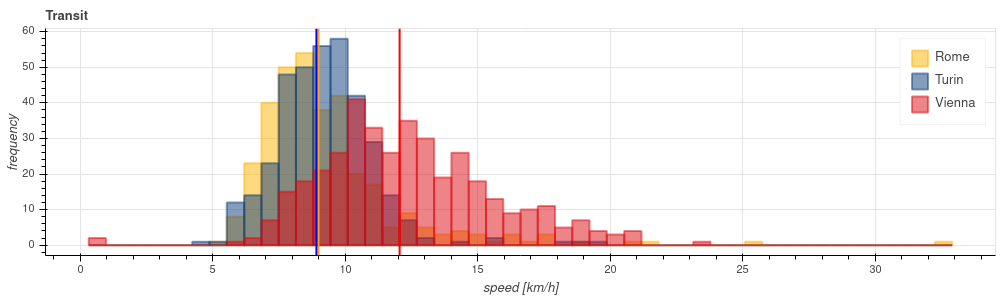

_[riassunto in Italiano sotto]_


  We know that some cities have a better public transport service than others, but is this _quantifiable_? I will here present my [work](https://gitlab.com/gablab/fast_cities) to show that the answer is affirmative; see the notebook [here](https://nbviewer.jupyter.org/urls/gitlab.com/gablab/fast_cities/-/raw/master/transit_distances.ipynb).

## Choosing an estimator

  I guess that a good estimate of the efficiency of how well public transport works is the average "speed" of the trips; we are not interested in the speed of the bus/tram/train, but in the total speed from the moment in which the user decides to leave, to the moment it arrives.

  Let me make an example, to show what I mean: it is 10:35 and I want to get to the Central Station; I get to the bus stop at 10:40, the bus arrives 10 minutes later, and I get to the station at 11:00, on time for my train. Now, we may be tempted to use the average speed of the bus: it travelled 3km in 10 minutes, so the average speed was 18km/h. But this does not tell us all we want to know: in fact this speed would have been the same whatever amount of time I had waited for it! Furthermore, the bus stop could have been farther from where I was, taking me even more time to catch a bus.<br>
  We are interested in knowing how much time I need to get from where I am at 10:35 to the station, so (supposing that the bus stop is so near that we can neglect this walking distance) it actually took me 25min to make 3km, meaning an average speed of... 7.2km/h, much less than our first estimate!


## Gathering data 

  I came up with this idea of using a web mapping service (like Google Maps, Bing Maps, Apple Maps, and the non-tracking Open Street Maps) to gather the data I needed. I chose Bing Maps, which I don't particularly like in itself, for some technical reasons that I will very briefly explain, because they help understanding how the process works.

  When we open a web mapping provider, we do not get directly to the database (container of information), but the web page (or the app) that we use do this for us, for two reasons: first, it can help us displaying the information in a clear way, making use of design and filtering out some details that are useful just for the code developers; second, it keeps this information under control, as a property, meaning that it is very difficult to copy the database and reuse it.

  However, these providers can allow access to some parts of the database, providing (usually in a freemium way) an **API key**, a password. Bing Maps was simply the one that had the easiest key to get.
<br>
Note that one does not get access to the whole database, but only specific requests can be made, for instance "which route should I take to get from where I am to the Central Station?", getting as an answer [something like](https://docs.microsoft.com/en-us/bingmaps/rest-services/examples/transit-route-example):
```
{  
  "start": {
    "name": "Vienna, Rathauspark",
    "coordinates": [16.359747, 48.210737]
  },
  "end": {
    "name": "Vienna, Central Station",
    "coordinates": [16.378198, 48.185112]
  },
  "distance": 3.0153km,
  "accessTime": "2020 10 25 10:35:34AM",
  "departureTime": "2020 10 25 10:50:12AM",
  "arrivalTime": "2020 10 25 11:00:22AM"
}
```

Considering what I wrote above, we are interested in the speed defined as <br>`(arrivalTime - accessTime)/distance`.


## Crunching these data
For the moment I dediced to focus my analysis on the rush hours of the afternoon, where it is mostly critical to have an efficient service. In this way I am not considering the very good coverage of evening hours in Vienna, so I am being kind to Torino and Roma. 

Oh, sorry, I did not present our characters: Torino, my hometown, wants to know how well its public transport system works, and has asked a couple of friends, Vienna (the city where I live now) and Roma, to help her. Vienna is known to have a very good public transportation system, while Rome is usually considered a city where you do not want to use a bus (I have scarce experience of transport in Roma, so we will see if this judgement is true).

So here is what I did: I selected a bunch of random points within 4km from the center of each city, then, again randomly, I selected couples among them, in order to ask the map provider for route directions. I then saved the distance and the speed as we defined it above.


The scatter plot of the speed data against the distance shows a trend for Vienna having faster trips.


This trend is more clear looking at the histogram, where the average speed is higher than in Torino and Roma; even more interesting is noticing that the speeds in Vienna are spreaded on a wider range on the right, meaning that many are fast (around 15km/h), but very few are slow (around 7km/h) as opposite to Torino and Roma. 


## Conclusions

Good news, our estimator seems to work! It really shows a difference between the "slow" Italian cities and Vienna, which is [ranked](https://www.forbes.com/sites/niallmccarthy/2017/10/30/the-worlds-top-cities-for-sustainable-public-transport-infographic/#629c8b73c1ed) among the best in the world. But not such good news, since there is still a lot of work to be done.

Rome does not seem to be so bad, though. As I said, I do not have experience with this city, but I expect that the complaints refer to delays (that in Torino, I would say, are critical just during morning rush hours). Here I should note that this analysis **does not take into account delays**: the Bing Maps provider just does not give this information for these cities. So my results only tell us how well the _theoretical_ public transport plan works. <br>
It follows that, expecially in rush hours, these results may differ from reality. I think that this work can still tell us something about the quality of public transport in these Italian cities, which is far from ideal even on the theoretical side.

______

Sappiamo che alcune città hanno un sistema di trasporto pubblico migliore di altre, ma questo dato si può quantificare?

## Scegliere un estimatore

La velocità (spazio fratto tempo) media può essere una buona stima di quanto bene funzioni il trasporto pubblico in una città. Bisogna essere attenti, però, non ci interessa la velocità del mezzo di trasporto in sé, quanto quella totale, del viaggiatore, dal momento in cui decide di partire all'arrivo.

## Raccolta dei dati

Ho usato Bing Maps per raccogliere i dati di cui avevo bisogno. Ho scelto questo servizio per la facilità di ottenere un'API key, ossia una password che permette di richiedere dati al database che sottostà alle mappe stesse. 

## Analisi dei dati

Ho scelto tre città per l'analisi: Torino, di cui sono interessato a dare una valutazione, Roma, del cui trasporto pubblico ho sentito parlare male, e Vienna, dove vivo, che risulta particolarmente virtuosa.

Ho scelto in modo casuale un certo numero di coppie di luoghi entro una distanza dal centro della città, per poi chiedere a Bing Maps le indicazioni di percorso da uno all'altro. Infine, ho calcolato la velocità necessaria seguendo quanto detto sopra, e ho creato i grafici riportati in questa pagina.

## Conclusioni

Roma non sembra così male, ma questa analisi non tiene conto dei ritardi. La scelta dell'estimatore risulta comunque valida, dato che Vienna ottiene, come atteso, ottimi risultati. <br>
Qualunque sia lo stato dei ritardi, Torino e Roma hanno molto margine di migliorare il proprio servizio di trasporti pubblici.
______

(<span>Photo by <a href="https://unsplash.com/@uniqueton?utm_source=unsplash&amp;utm_medium=referral&amp;utm_content=creditCopyText">Anton</a> on <a href="https://unsplash.com/s/photos/bus-vienna?utm_source=unsplash&amp;utm_medium=referral&amp;utm_content=creditCopyText">Unsplash</a></span>)
